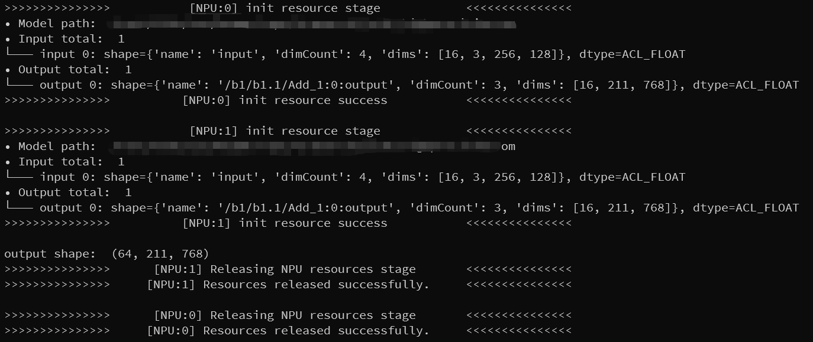

# pyACL-inference

[](http://gitlab.buaadml.info/bdi/pyacl-inference/-/blob/main/LICENSE)
[]()
[](http://gitlab.buaadml.info/bdi)
[](https://gitee.com/ascend/samples)
[](https://www.hiascend.com/zh/software/cann)

### TODO ###
- [x] 修复使用numpy view可能无法正确memcpy底层数组到显存的bug
- [x] 动态batch推理
- [x] 增加对多输出模型的支持
- [ ] 增加对多输入模型的支持
### Quick Start ###

**Prerequisites**：使用`atc`深度学习编译器（[link](https://support.huawei.com/enterprise/zh/doc/EDOC1100192461/f269b5ab)）转化得到`.om`模型（`.pt`需先转`.onnx`）

1. 使用`ACLNetHandler`管理模型与推理所用`NPU`逻辑号，后者可在`npu-smi info`指令中查看
2. 由于官方`API`的使用约束，使用华为模型的**每个进程**必须在始尾处调用`init_huawei_api/finalize_huawei_api`，或使用`using_huawei_api`装饰进程主函数
3. 推理输入为`[batch, ...]`的`np.ndarray`；调用`ACLNetHandler.forward()`或`ACLNetHandler.__call__()`推理，会尽量使用指定的`npu_devices`并行推理；单输出模型推理输出为`np.ndarray`，多输出模型输出为`List[np.ndarray]`，具体大小/类型参见加载模型时志记的信息
4. `ACLNetHandler`管理`NPU`资源，资源析构必须依赖`acl.rt / acl.mdl`，因此需要使用`release()`或`__del__()`方法显示析构，而不能依赖`GC`

示例代码：

推荐写法（RAII风格）
```python
from huawei_api import ACLNetHandler, using_huawei_api, using_acl_net_handler
import numpy as np
@using_huawei_api
def run():
    with using_acl_net_handler(npu_device_ids=[0, 1],om_model_path="/path/to/model.om") as net:
        dummy = np.random.random((16 * 4, 3, 256, 128)).astype(np.float32)
        output = net(dummy)
        print("output shape: ", output.shape)
run()
```
or

```python
from huawei_api import ACLNetHandler, using_huawei_api
import numpy as np
@using_huawei_api
def run():
    huawei_model = ACLNetHandler(npu_device_ids=[0, 1],om_model_path="/path/to/model.om")
    dummy = np.random.random((16 * 4, 3, 256, 128)).astype(np.float32)
    output = huawei_model(dummy)
    print("output shape: ", output.shape)
    huawei_model.release()
run()
```

or

```python
from huawei_api import ACLNetHandler, init_huawei_api, finalize_huawei_api
import numpy as np
init_huawei_api()

huawei_model = ACLNetHandler(npu_device_ids=[1],om_model_path="/path/to/model.om")
dummy = np.random.random((16 * 4, 3, 256, 128)).astype(np.float32)
output = huawei_model(dummy)
del huawei_model
# or huawei_model.release()

finalize_huawei_api()
```
一个可能期望的输出：


### Warnings ###

- 单次推理内是并行的，两次推理之间是需要同步的
- 现不支持多输入模型，`ACLNetHandler.forward()`只接受单`np.ndarray`参数
- 推理输入数据`batch_size`小于`.om`模型真实`batch_size`×使用`NPU`数时，不会启用并行推理或并行任务分配是不公平的，因此业务中实际推理`batch_size`需视使用`NPU`数而定
- `ACLNetHandler`不对输入`np.ndarray`数据维度、大小作任何检查（但在推理时必定会将输入`numpy`数组数据类型与`.om`模型保持一致），不保证输入不符预期时一定能抛出异常
- `ACLNetHandler`不保护显存，使用时，需要将推理预处理、推理后处理、batch_size约束与`ACLNetHandler`封装成新的模型类再加入业务代码中


### Precision Loss ###
| model/device       | batch_shape       | alignment to .onnx | inference time | inference speed |
| ------------------ | ----------------- | ------------------ | -------------- | --------------- |
| TransReID(310P3)   | [16, 3, 256, 128] | 99.9988%           | 8.539 ms/img   | 117.109 img/s   |
| TransReID(310P3×2) | [16, 3, 256, 128] | 99.9989%           | 5.174 ms/img   | 193.274 img/s   |


_Reference: pyACL doc_  [link](https://support.huawei.com/enterprise/zh/doc/EDOC1100164876/5bda6391)
